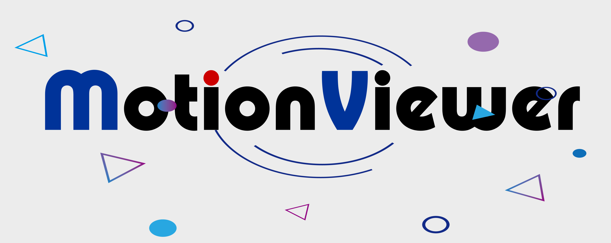
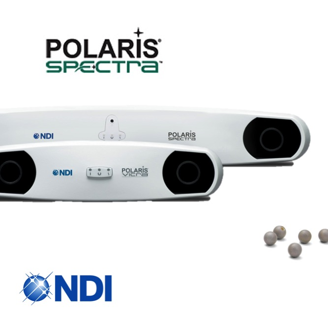
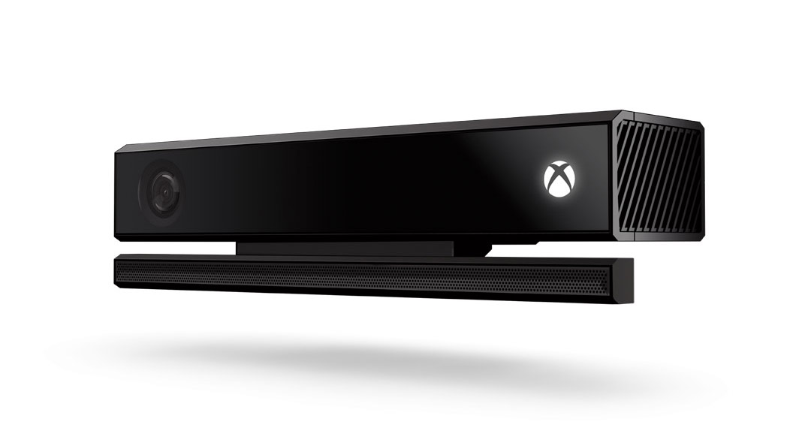
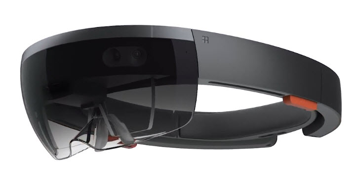

  
  <h1>Motion Viewer</h1>
  <blockquote> Data Visualization for NDI and HoloLens based on Qt </blockquote>

### 应用概述

**MotionViewer是一个针对NDI Spectra双目定位系统、Kinect深度相机及HoloLens混合现实眼镜的数据可视化程序，用于基于混合现实的医疗手术辅助系统。**

#### 依赖库

1. [Qt]( https://www.qt.io/cn) 用于GUI设计
2. [OpenGL](https://www.opengl.org/)  用于场景3D显示
3. [Assimp](https://www.assimp.org/) 用于加载3D模型
4. [OpenCV](https://opencv.org/) 用于Kinect视觉图像 （暂未使用）
5. [Eigen](http://eigen.tuxfamily.org/index.php?title=Main_Page) 矩阵运算库（暂未使用）
6. [Boost](https://www.boost.org/) C++准标准库（暂未使用）

#### 功能

1. 采集NDI的Marker点数据并做相应处理；

2. 将坐标数据发送给HoloLens；

3. 配准设置与结果可视化；

4. 可视化HoloLens视频流与扫描设备（Kinect）视频流*；

> 注：*为扩展功能，暂时不实现，预留接口

### 具体设计

#### 功能1：采集NDI的Marker点数据并做相应处理

功能需求：

1. 串口或网口(预留)通信，同步收发指令（一问一答）；
2. 解码，根据NDI通信规则解码出各个marker的坐标(x,y,z)（Marker点大概在20个以内）；
3. 显示所有Marker点坐标
4. 通过下拉菜单选择需要计算方法，并点击按钮计算，将结果显示。显示标定件位姿（3-4个标定件）
5. 显示各标定件位置关系图(预留)

设计思路：

1. 自定义**NdiComm**类，负责实现NDI的通信功能，隐藏通信实现细节
   1. 利用QTcpSocket与QTcpServer类实现TCP通信
   2. 利用QSerialPort类实现串口通信
2. 自定义**NdiViewer**类，用来存储NDI数据并进行相应处理
   1. 利用**QVector3D**类存储每个Marker点坐标
   2. 利用**QList\<QVector3D\>**管理所有Marker点坐标
   3. 定义*获取当前标定件位置*，*获取投影后位置*，*更新矫正矩阵*三个函数

#### 功能2：将坐标数据发送给HoloLens

功能需求：

1. 利用TCP或UDP将NDI得到的坐标信息发送给HoloLens；
2. 可以作为服务器或者客户端；
3. 对于服务器，可以设置服务器IP，服务器端口号等相关信息；
4. 对于客户端，可以设置目标IP，目标端口号等相关信息；
5. 可以发送追踪机械的位姿信息；

设计思路：

1. 自定义**HoloComm**类，负责实现NDI的通信功能，隐藏通信实现细节
   1. 利用QTcpSocket与QTcpServer类实现TCP通信
   2. 利用QUdpSocket类实现UDP通信

#### 功能3：可视化HoloLens视频流与扫描设备（Kinect）视频流

功能需求：

1. 可视化HoloLens视频流
2. 可视化扫描设备（Kinect）视频流

#### 功能4：配准设置与结果可视化

功能需求：

1. 显示术前模型与术中采集模型
2. 显示术前模型与术中采集模型的配准结果，并显示获得的旋转矩阵

### 文件结构

- **MainWindow类** （mainwindow.h, mainwindow.cpp, mainwindow.ui）主界面框架
- **NdiComm类**
- **NdiViewer类**
- **HoloComm类**
- **HoloViewer类**
- **RegiViewer类**
- **GLViewer类**
- **AboutDlg类**（aboutdlg.h, aboutdlg.cpp, aboutdlg.ui）About对话框显示
- **Backdrop类**
- **NdiTool类**
- **Model类**
- **Mesh类**
